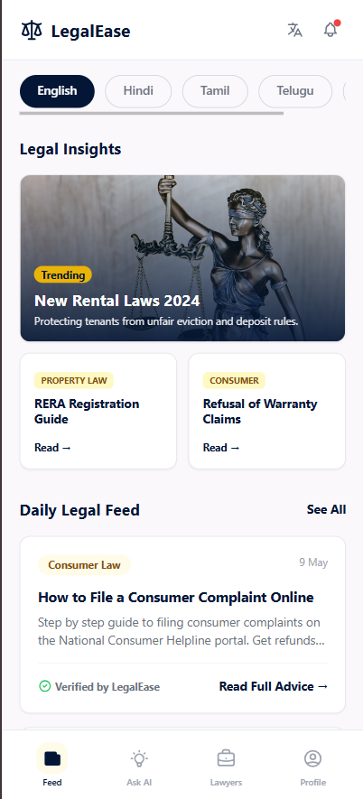
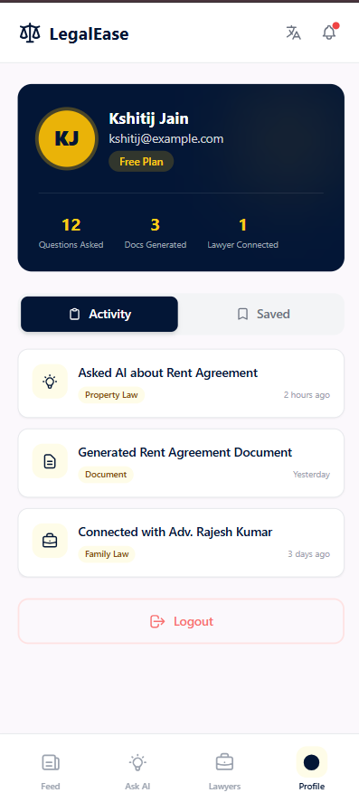
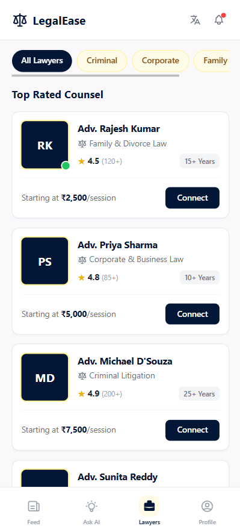

# LegalEase 🏛️

> AI-powered legal assistance for every Indian — Free, Simple & Multilingual

## App Screenshots

| Feed | Ask AI | Lawyers |
|------|--------|---------|
|  |  |  |

## Problem Statement
Common Indians struggle with basic legal tasks — rent agreements, consumer complaints, court cases — and can't afford lawyer fees for every small issue.

## Solution
LegalEase provides:
- 🤖 AI Legal Assistant — ask legal questions in Hindi, English, Tamil, Telugu
- 📰 Legal Feed — stay updated with latest laws and judgments
- 👨‍⚖️ Lawyer Directory — connect with verified lawyers
- 📄 Document Generator — create rent agreements, affidavits (coming soon)

## Tech Stack
### Frontend
- React.js
- Tailwind CSS
- Axios
- React Router DOM

### Backend
- Node.js + Express.js
- MongoDB + Mongoose
- JWT Authentication
- bcryptjs

### Data Sources
- data.gov.in — Government legal datasets
- Indian Kanoon — Legal database (web scraping)

## Project Structure
\```
legalease/
├── client/          # React Frontend
│   └── src/
│       ├── pages/
│       │   ├── Feed.jsx
│       │   ├── AskAI.jsx
│       │   ├── Lawyers.jsx
│       │   └── Profile.jsx
│       └── components/
│           ├── Navbar.jsx
│           └── BottomNav.jsx
└── server/          # Node.js Backend
    ├── models/
    │   ├── User.js
    │   ├── FeedPost.js
    │   └── Lawyer.js
    ├── routes/
    │   ├── auth.js
    │   ├── feed.js
    │   └── lawyers.js
    ├── server.js
    └── seed.js
\```

## Getting Started

### Prerequisites
- Node.js v18+
- MongoDB Atlas account

### Installation

**Clone the repo**
```bash
git clone https://github.com/yourusername/legalease.git
cd legalease
```

**Backend setup**
```bash
cd server
npm install
```

Create `.env` file in server folder:
```
PORT=5000
MONGO_URI=your_mongodb_connection_string
JWT_SECRET=your_jwt_secret
```

```bash
npm run dev
```

**Frontend setup**
```bash
cd client
npm install
npm start
```

**Seed database**
```bash
cd server
node seed.js
```

## API Endpoints
| Method | Endpoint | Description |
|--------|----------|-------------|
| GET | /api/feed | Get all feed posts |
| POST | /api/feed | Create feed post |
| GET | /api/lawyers | Get all lawyers |
| POST | /api/auth/signup | Register user |
| POST | /api/auth/login | Login user |

## Features Roadmap
- [x] Legal Feed — backend connected
- [x] Lawyer Directory — backend connected
- [x] Navigation — React Router
- [ ] AI Assistant — Gemini API integration
- [ ] Document Generator
- [ ] Authentication — Login/Signup
- [ ] Web Scraping — Indian Kanoon

## Patent Status
Filed with Poornima University — Indian Patent Office
Unique angle: Multilingual (Hindi, English, Tamil, Telugu) + Govt open data + Common Indian focus

## Author
Kshitij Jain
B.Tech CSE (AI & ML) — 3rd Year